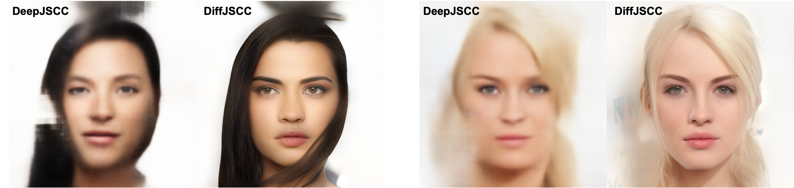

<div align="center">
    
# Diffusion-Aided Joint Source Channel Coding for High Realism Wireless Image Transmission

[](http://arxiv.org/abs/2404.17736) 


</div>

This is the official implementation of "Diffusion-Aided Joint Source Channel Coding for High Realism Wireless Image Transmission"

## Installation

    git clone https://github.com/mingyuyng/DiffJSCC.git
    cd DiffJSCC

    # create environment
    conda create -n diffjscc python=3.9
    conda activate diffjscc
    pip install -r requirements.txt

## Datasets

### OpenImage dataset

Please run the script below to prepare the OpenImage dataset. Note that `awscli` needs to be installed before running this script. Please refer to [OpenImage download](https://github.com/cvdfoundation/open-images-dataset#download-full-dataset-with-google-storage-transfer)

    bash prepare_OpenImage.sh

### Other datasets

We also provide other datasets including CelebAHQ512 and Kodak. The readers could download them from [Google Drive](https://drive.google.com/drive/folders/1bGWQNs_n5NUatOmRajsdQsLWfL7n3KE2?usp=drive_link).

### Data folder structure

```plaintext
/data                            # Root directory
|-- /OpenImage                   # Open Image dataset
|   |-- /018ed13fabd94731.jpg             
|   |-- /00e48838f27aa1a3.jpg         
|-- /CelebAHQ_train_512          # CelebAHQ train set
|   |-- /0.png              
|   |-- /1.png 
|-- /CelebAHQ_test_512           # CelebAHQ test set
|   |-- /27000.png              
|   |-- /27001.png
|-- /Kodak                       # Kodak dataset
|   |-- /1.png              
|   |-- /2.png 
```

### Split the train and val set

Please run the following script to split the training set and validation set. The list of images will be placed in `datalist` folder

    bash create_data_list.sh


## Train the JSCC encoder and decoder

### OpenImage dataset
    
ResNet structure
    
    python train.py --config ./configs/train_jscc_cnn.yaml --name "jscc_cnn_openimage" --refresh_rate 1

SwinJSCC

    python train.py --config ./configs/train_jscc_swin.yaml --name "jscc_swin_openimage" --refresh_rate 1

Note that the data paths in `configs/dataset/JSCC_OpenImage_train.yaml` and `configs/dataset/JSCC_OpenImage_val.yaml` need to be modified

### CelebA dataset
    
ResNet structure
    
    python train.py --config ./configs/train_jscc_cnn_CelebA.yaml --name "jscc_cnn_CelebA" --refresh_rate 1

SwinJSCC

    python train.py --config ./configs/train_jscc_swin_CelebA.yaml --name "jscc_swin_CelebA" --refresh_rate 1

Note that the data paths in `configs/dataset/JSCC_CelebA_train.yaml` and `configs/dataset/JSCC_CelebA_val.yaml` need to be modified


## Train the conditional diffusion model

### Download the weights of Stable Diffusion

    wget https://huggingface.co/stabilityai/stable-diffusion-2-1-base/resolve/main/v2-1_512-ema-pruned.ckpt --no-check-certificate

### Merge the Stable Diffusion weights with the JSCC encoder and decoder

Here is an example of merging the weights of SD and ResNet-based JSCC

    python scripts/make_stage2_init_weight.py \
               --cldm_config configs/model/cldm_cnn.yaml \
               --sd_weight v2-1_512-ema-pruned.ckpt\
               --jscc_weight path/to/the/weights \
               --output ./init_weights/weights_cnn.ckpt
    
### Train the conditional diffusion model

OpenImage dataset

    python train.py --config ./configs/train_cldm.yaml --name 'cldm_cnn_OpenImage' --refresh_rate 1
   
Note that the paths within `/configs/train_cldm.yaml` need to be modified.

## Inference

Kodak dataset

    python inference_cldm.py \
    	--input ./data/Kodak \
    	--config configs/model/cldm_cnn.yaml \
    	--ckpt path/to/the/cldm/checkpoint \
    	--steps 50 \
    	--sr_scale 1 \
    	--color_fix_type wavelet \
    	--output output/folder \
    	--device cuda \
    	--repeat_times 5 \
    	--SNR 1 \    
            --use_lang \
            --show_lq \
            --use_guidance --Lambda 100 --g_t_start 1001 --g_t_stop -1 --g_repeat 1 \ # remove this if don't want intermediate guidance
            
CelebAHQ dataset

    python inference_cldm.py \
    	--input ./data/CelebAHQ_test_512 \
    	--config configs/model/cldm_cnn_celebA.yaml \
    	--ckpt path/to/the/cldm/checkpoint \
    	--steps 50 \
    	--sr_scale 1 \
    	--color_fix_type wavelet \
    	--output output/folder \
    	--device cuda \
    	--repeat_times 1 \
    	--SNR -5 \    
            --use_lang \
            --show_lq \
            --use_guidance --Lambda 100 --g_t_start 1001 --g_t_stop -1 --g_repeat 1 \ # remove this if don't want intermediate guidance
            


## Pre-trained weights

| Model Name    | Description | Link |
| -------- | ------- | ------- |
| OpenImage_C4.ckpt  | DiffJSCC trained on OpenImage dataset with C_channel=4 (CBR=1/384)    | [Download](https://drive.google.com/file/d/1vK9UXNOl0GFBl3DK3Xxvyy3K92SKhXTG/view?usp=drive_link) |
| OpenImage_C16.ckpt | DiffJSCC trained on OpenImage dataset with C_channel=16 (CBR=1/96)    | [Download](https://drive.google.com/file/d/1SS-T1mtsguUV47Vbi4Jsyk6JbzoVDqYI/view?usp=drive_link) |
| CelebAHQ_C2.ckpt    | DiffJSCC trained on CelebAHQ dataset with C_channel=2 (CBR=1/768)   | [Download](https://drive.google.com/file/d/14fn0uy-wkTgMwIAVpvwWQOCQBNJbca7s/view?usp=drive_link) |
| CelebAHQ_C8.ckpt    | DiffJSCC trained on CelebAHQ dataset with C_channel=8 (CBR=1/192)   | [Download](https://drive.google.com/file/d/1gd_sAJqApUkYlXmq8XamNAGhiopzMjbS/view?usp=drive_link) |

When applying the pre-trained weights, please also assign the correct `C_channel` variable in `cldm_cnn.yaml` or `cldm_cnn_celebA.yaml`. 

## Visualizations

### Kodak Images (CBR=1/384, SNR=1dB)


### CelebAHQ Images (CBR=1/768, SNR=-5dB)



## Acknowledgement 

This project is largely based on [DiffBIR](https://github.com/XPixelGroup/DiffBIR) and [SwinJSCC](https://github.com/semcomm/SwinJSCC). Thanks for their awesome work.

## Reference

> Mingyu Yang, Bowen Liu, Boyang Wang, Hun-Seok Kim, "Diffusion-Aided Joint Source Channel Coding For High Realism Wireless Image Transmission"

    @article{yang2024diffusion,
      title={Diffusion-Aided Joint Source Channel Coding For High Realism Wireless Image Transmission},
      author={Yang, Mingyu and Liu, Bowen and Wang, Boyang and Kim, Hun-Seok},
      journal={arXiv preprint arXiv:2404.17736},
      year={2024}
    }


