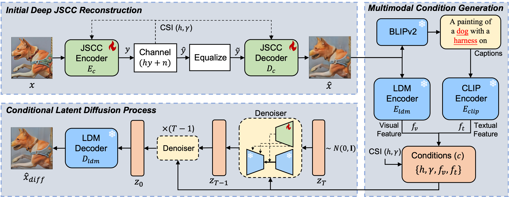

# DiffJSCC

The repository contains the code for [Diffusion-Aided Joint Source Channel Coding for High Realism Wireless Image Transmission (arxiv)](https://arxiv.org/pdf/2404.17736). 




## Installation

    git clone https://github.com/mingyuyng/DiffJSCC.git
    cd DiffJSCC

    # create environment
    conda create -n diffjscc python=3.9
    conda activate diffjscc
    pip install -r requirements.txt

## Datasets

### OpenImage dataset

Please run the script below to prepare the OpenImage dataset. Note that `awscli` needs to be installed before running this script. Please refer to [OpenImage download](https://github.com/cvdfoundation/open-images-dataset#download-full-dataset-with-google-storage-transfer)

    bash prepare_OpenImage.sh

### Other datasets

We also provide other datasets including CelebAHQ512 and Kodak. The readers could download them from [Google Drive](https://drive.google.com/drive/folders/1bGWQNs_n5NUatOmRajsdQsLWfL7n3KE2?usp=drive_link).

### Data folder structure

```plaintext
/data                            # Root directory
|-- /OpenImage                   # Open Image dataset
|   |-- /018ed13fabd94731.jpg             
|   |-- /00e48838f27aa1a3.jpg         
|-- /CelebAHQ_train_512          # CelebAHQ train set
|   |-- /0.png              
|   |-- /1.png 
|-- /CelebAHQ_test_512           # CelebAHQ test set
|   |-- /27000.png              
|   |-- /27001.png
|-- /Kodak                       # Kodak dataset
|   |-- /1.png              
|   |-- /2.png 
```

### Split the train and val set

Please run the following script to split the training set and validation set. The list of images will be placed in `datalist` folder

    bash create_data_list.sh


## Train the JSCC encoder and decoder

### OpenImage dataset
    
ResNet structure
    
    python train.py --config ./configs/train_jscc_cnn.yaml --name "jscc_cnn_openimage" --refresh_rate 1

SwinJSCC

    python train.py --config ./configs/train_jscc_swin.yaml --name "jscc_swin_openimage" --refresh_rate 1

Note that the data paths in `configs/dataset/JSCC_OpenImage_train.yaml` and `configs/dataset/JSCC_OpenImage_val.yaml` need to be modified

### CelebA dataset
    
ResNet structure
    
    python train.py --config ./configs/train_jscc_cnn_CelebA.yaml --name "jscc_cnn_CelebA" --refresh_rate 1

SwinJSCC

    python train.py --config ./configs/train_jscc_swin_CelebA.yaml --name "jscc_swin_CelebA" --refresh_rate 1

Note that the data paths in `configs/dataset/JSCC_CelebA_train.yaml` and `configs/dataset/JSCC_CelebA_val.yaml` need to be modified


## Train the conditional diffusion model

### Download the weights of Stable Diffusion

    wget https://huggingface.co/stabilityai/stable-diffusion-2-1-base/resolve/main/v2-1_512-ema-pruned.ckpt --no-check-certificate

### Merge the Stable Diffusion weights with the JSCC encoder and decoder

